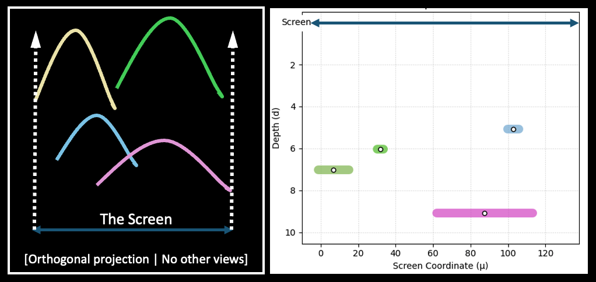
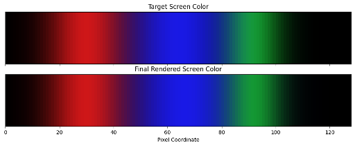

In this tutorial, I try to write some demo code for 1d rendering. For illustrate how gaussian splatting works, however, if move into 1d case, some properties will changed, for example, there will be no need to work with *c2w* matrix. And I continue to simplfy the working principle, some difference from normal gaussian splatting illustrated in the figure below.

<figure style="text-align: center">
    
    <figcaption style="text-align: center"> Our 1D Gaussian Splatting Rendering Illustration. </figcaption>
</figure>

<figure style="text-align: center">
    
    <figcaption style="text-align: center">Color visualization of 1D Gaussian points.</figcaption>
</figure>

---
We will need to finish several parts of code, mainly contain:

- A 1D Gaussian Render, using alpha-blending as original 3D gaussian splatting;
- A Gaussian dataclass, which contains *Opacity*, *Position*, *Color*...
- An optimizer based on PyTorch, which make these gaussian could be optimized;

Attention! We will not implement the Adaptive Control Strategy which is really important and necessary for 3D Gaussian Splatting, refer to the original paper. This means our 1D gaussians number will keep the same, won't be changed after initializaion.
